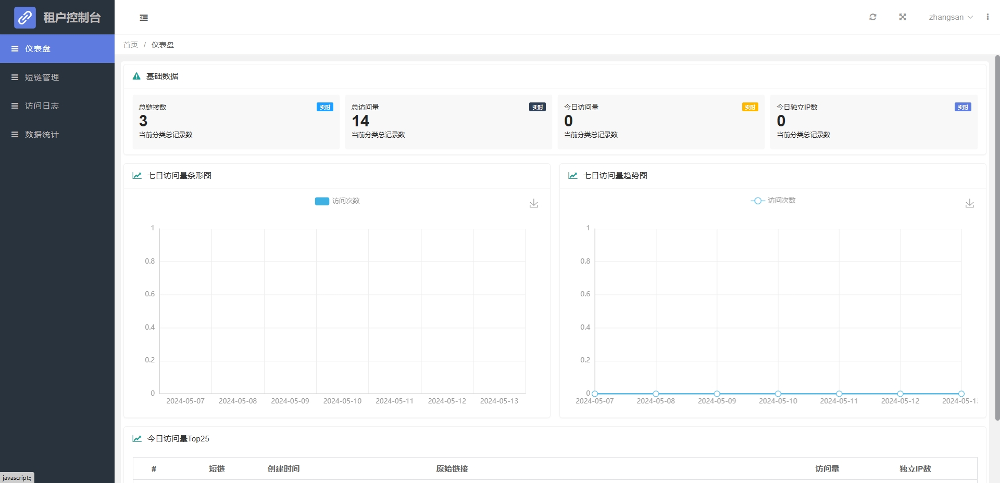
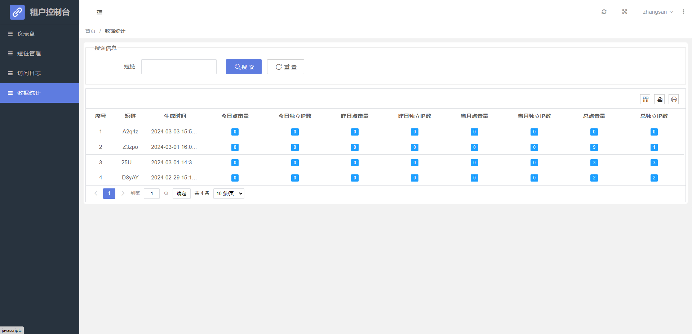
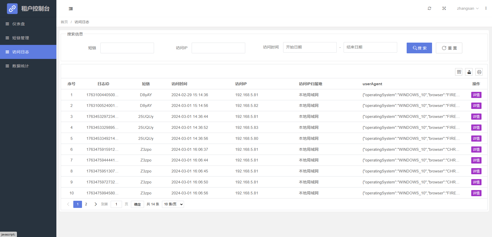

# tiny-url
# 在线短链接生成平台

<a href='https://gitee.com/leisureLXY/tiny-url/stargazers'></img></a>
<a href='https://gitee.com/leisureLXY/tiny-url/members'></img></a>

## 已实现功能
1、将长链接转换成短链接，访问短链接时， 302重定向至原始长链接

2、支持设置短链的有效期限

3、支持记录访问次数，访问日志

4、使用布隆过滤器优化短链冲突问题，提高高并发下的性能表现

5、支持多租户功能，租户注册后可拥有独立的后台数据管理功能（包括短链管理、数据统计，访问日志等）

6、租户支持通过API调用方式生成短链接、禁用/启用短链接、更新短链有效期限、查看短链接统计信息等功能，提供成熟的API接口文档和鉴权方案（access_key + access_key_secret）

## 计划实现功能
1、超级管理员系统管理功能（用于管理租户）

2、带访问密码的短链，访问时重定向到输入密码的页面，输入密码后方可访问

3、带最大可用次数的短链，如设置访问限制100次，超出后则禁止访问

4、API接口提供更丰富的功能(如查询接口、短链还原长链接口等)

## 部分界面展示
首页

  
api接口文档页

  
关于我们页

  
短链寻址失败时-404页

  
短链寻址失败时-失效页

  
租户登录页

  
租户注册页

  
租户后台数据管理

## 主要技术选型
| 依赖                | 说明           |
|-------------------|--------------|
| SpringBoot 3.1.9  | 基础框架         |
| Hikari            | 高性能数据库连接池 |
| MyBatis-Plus      | MyBatis的增强ORM |
| JdbcTemplate      | 持久层框架        |
| Redis             | 业务缓存、会话共享    |
| Guava             | Hash算法、布隆过滤器 |
| Layui             | 前端模板         |

## 运行环境
- Jdk17
- MySQL5.6+
- Redis3.0+

## 启动部署教程

1. 新建`MySQL`数据库并导入`resources/init`文件夹下的数据库脚本
2. 修改配置文件中`application.yml`中`数据库`和`Redis`连接信息
3. 运行启动类`TinyUrlApplication`，即可正常启动项目
4. 平台首页地址：`http://localhost:9999/`
5. 租户登录地址：`http://192.168.0.107:9999/page/tenant/login.html`  账户密码 `zhangsan / 123456`

## 实现逻辑
1、使用 MurmurHash 算法将原始长链接 hash 为 32 位散列值，将散列值转为 BASE62 编码 ，即为短链接。

2、用户访问短链接时，在 Redis 中查找是否存在缓存，存在则刷新缓存时间，302 重定向至原始长链接，并自增短链接访问量，记录访问日志；
缓存中不存在，则去数据库查找，查找成功则添加到 Redis 缓存，302 重定向至原始长链接，并自增短链接访问量，记录访问日志；
数据库中若也不存在，则跳转到404页面；

3、具体实现参考文章：[掘金-高性能短链设计](https://juejin.cn/post/6844904090602848270)

## 部分技术介绍
1、MurmurHash：MurmurHash 是一种非加密型哈希函数，适用于一般的哈希检索操作。
与其它流行的MD5等哈希函数相比，对于规律性较强的 key，MurmurHash 的随机分布特征表现更良好。
非加密意味着着相比 MD5，SHA 这些函数它的性能肯定更高（实际上性能是 MD5 等加密算法的十倍以上）。
MurmurHash 有 32 bit、64 bit、128 bit 的实现，32 bit 已经足够表示近 43 亿个短链接。
使用 Java 的话，在 Google 的 [guava](https://github.com/google/guava)
或 [hutool](https://github.com/dromara/hutool) 中有相应实现，这里选择 guava 的实现。

2、base62：MurmurHash 生成的哈希值最长有 10 位十进制数，为了进一步缩短短链接长度，可以将哈希值转为 base62 编码，这样最长就只有 6 个字符了。

3、Redis：生成短链接后，通常在后续一段时间内此短链接的访问频率较高，则向 Redis 中添加带过期时间的缓存来减轻数据库压力。

4、301 和 302 重定向的区别
- 301，代表 **永久重定向**，也就是说第一次请求拿到长链接后，下次浏览器再去请求短链的话，不会向短网址服务器请求了，而是直接从浏览器的缓存里拿，这样在 server 层面就无法获取到短网址的点击数了，如果这个链接刚好是某个活动的链接，也就无法分析此活动的效果。所以我们一般不采用 301。
- 302，代表 **临时重定向**，也就是说每次去请求短链都会去请求短网址服务器（除非响应中用 Cache-Control 或 Expired 暗示浏览器缓存）,这样就便于 server 统计点击数，所以虽然用 302 会给 server 增加一点压力，但在数据异常重要的今天，这点代码是值得的，所以推荐使用 302！

5、多租户方案介绍：
多租户技术，或称多重租赁技术，是一种软件架构技术。它探讨的是如何于多用户的环境下共用相同的系统或者程序组件，并且确保各个用户数据的隔离性。在云计算迅速发展的今天，多租户技术被广为运用于开发云各式服务，不论是 IaaS、PaaS 还是 SaaS，都可以看到多租户技术的影子，SaaS 应用与其它应用最大的差异特征就是多租户。

多租户软件架构的设计目标：
- 保证多个租户使用统一的SaaS云平台，同时对多个租户进行良好的隔离;
- 能够保证SaaS云平台进行统一的升级,又不破坏各自的应用逻辑;
- 支持业务数据的横向扩展,并能够支持某个租户单独扩展资源的能力;

在多租户架构中，根据数据隔离情况可以分为以下三种情况：
- 数据库分离
- 共享数据库，schema分离
- 共享数据库，共享schema

多租户架构类型对比:

| 多租户架构类型 | 优点 | 缺点 |
| ------- | ------- | ------- |
|     数据库分离    |   为不同的租户提供独立的数据库，有助于简化数据模型的扩展设计，满足不同租户的独特需求；如果出现故障，恢复数据比较简单   | 增多了数据库的安装数量，随之带来维护成本和购置成本的增加 |
| 共享数据库,Schema独立 | 为安全性要求较高的租户提供了一定程度的逻辑数据隔离，并不是完全隔离；每个数据库可支持更多的租户数量 | 如果出现故障，数据恢复比较困难，因为恢复数据库将牵涉到其他租户的数据；如果需要跨租户统计数据，存在一定困难 |
| 共享数据库，共享schema | 维护和购置成本最低，允许每个数据库支持的租户数量最多 | 隔离级别最低，安全性最低，需要在设计开发时加大对安全的开发量； 数据备份和恢复最困难，需要逐表逐条备份和还原 |

本项目属于简单实现，故选用第三种方案